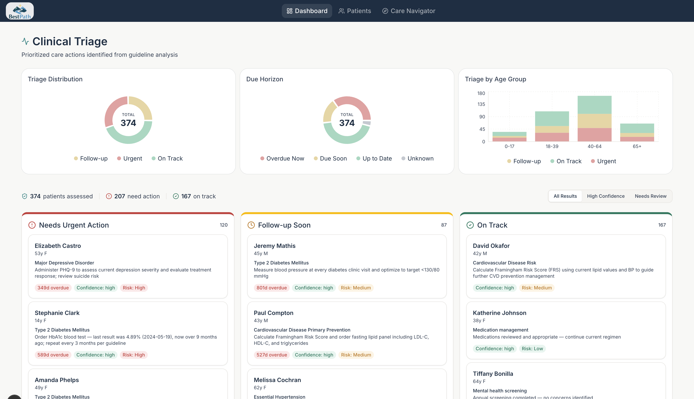

# BestPath — Proactive Care Intelligence Platform



BestPath identifies the next-step highest-value clinical action for patients based on all available information — the screening, medication start, referral, or follow-up most likely to prevent an emergency — and surfaces it with evidence so clinicians can act with a single click before conditions escalate.

**Live Demo:** [healthcare-hackathon-capital-reasoning-team.vercel.app](https://healthcare-hackathon-capital-reasoning-team.vercel.app)

**Slides:** [Google Slides](https://docs.google.com/presentation/d/1m-cJ8LfStrVDRULew8hPcvo2w552Sed5jM8zExUflwQ/edit?usp=sharing)

## Team

- **Nicholas Miller** 
- **Peter Salmon** 

[Capital Reasoning Solutions](https://capitalreasoning.com)

## Challenge Track

**Track 1: Clinical AI** 

## Problem

Clinics are overwhelmed with reactive care. Millions of Canadians are without a family doctor. Patients end up in the ER because a blood pressure medication wasn't started, a referral wasn't made, a follow-up after an abnormal result never happened. These are preventable emergencies.

## Solution

BestPath is a dual-interface clinical intelligence engine:

**Clinician View** — a proactive triage dashboard. 

The system analyzes patients against clinical guidelines, determines the next best clinical action for each, and surfaces a prioritized queue: Red (overdue + high risk), Yellow (overdue + lower risk), Green (on track). Every recommendation is cited against specific clinical guidelines.

**Patient Navigator** — a conversational care navigator.

A care navigator for people without a family doctor, or anyone looking to get sent in the right direction. Enter your health information conversationally, get evidence-based guidance on what you need and who can help — pharmacist, dietitian, walk-in clinic, LifeLabs — not just "see a doctor."

Both interfaces run on the same core: patient data + clinical guidelines via RAG → deterministic comparison → prioritized, evidence-backed next best actions.

## How It Works

The assessment engine runs a three-phase pipeline per patient:

**Phase A — Evidence Gathering.** Claude Sonnet 4.6 receives the patient's full clinical context (demographics, conditions, medications, recent encounters, latest labs, vitals) and makes up to 6 tool calls into the RAG corpus, searching clinical guidelines for every condition, active medication, abnormal lab, and risk factor.

**Phase B — Structured Synthesis.** A second pass takes the gathered evidence and generates a structured clinical assessment — each target action with condition, screening type, risk tier, confidence level, and cited guideline excerpts. High-confidence targets with zero evidence citations are automatically demoted to low confidence.

**Phase C — Deterministic Comparator.** Pure date math, no AI: `lastCompletedDate + recommendedIntervalDays` vs. today determines overdue status. A multi-factor scoring formula combines risk tier, overdue status, days overdue (capped at 180), and confidence into a single `actionValueScore` that determines triage priority:

```
actionValueScore = riskPoints + statusPoints + min(overdueDays, 180) + confidencePoints
```

Patients are categorized: **Red** (overdue + high risk), **Yellow** (overdue or due soon), **Green** (on track). Every recommendation traces back to a specific guideline passage.

Batch processing runs up to 3 patients in parallel, orders by encounter count (richest data first), and skips already-assessed patients unless forced. All results are append-only — history is preserved for audit trails.

## Tech Stack

| Layer         | Technology                                                                           |
| ------------- | ------------------------------------------------------------------------------------ |
| Framework     | Next.js 16 (App Router) · TypeScript (strict)                                        |
| Styling       | Tailwind v4 · shadcn/ui                                                              |
| Database      | Supabase (Postgres + pgvector) · Drizzle ORM                                         |
| AI Engine     | Claude Sonnet 4.6 (assessment) · Claude Opus 4.6 (interactive agent) · Vercel AI SDK |
| RAG Pipeline  | LlamaParse → Gemini Embeddings (3072-dim) → pgvector hybrid search                   |
| Generative UI | OpenUI (27 agent-renderable components)                                              |
| Charts        | Recharts                                                                             |
| State         | Zustand                                                                              |

### Architecture

```
┌─────────────────────────────────────────────────────────┐
│  Clinician Dashboard          Patient Navigator         │
│  (Server-rendered + client)   (Conversational chat)     │
├─────────────────────────────────────────────────────────┤
│  Assessment Engine (3-phase)  │  Agent Panel (OpenUI)   │
│  Phase A: RAG tool-use loop   │  27 renderable components│
│  Phase B: Structured output   │  Streaming reveal       │
│  Phase C: Date math scoring   │  Glass morphism UI      │
├───────────────────────────────┴─────────────────────────┤
│  Hybrid Search (RRF)                                    │
│  Vector (cosine, HNSW) + Keyword (tsvector/GIN)         │
├─────────────────────────────────────────────────────────┤
│  Supabase Postgres + pgvector                           │
│  11 tables · 3072-dim embeddings · append-only results  │
└─────────────────────────────────────────────────────────┘
```

### RAG & Search

Search uses a **hybrid retrieval** strategy combining two methods with Reciprocal Rank Fusion (RRF):

- **Vector search** — Cosine similarity on 3072-dimensional Gemini embeddings, indexed with HNSW (`m=16, ef_construction=64`)
- **Keyword search** — PostgreSQL full-text search with GIN indexes and `ts_rank()` scoring
- **Fusion** — Each method returns `topK × 2` results; RRF re-ranks with `score = Σ weight / (60 + rank)` and returns the top-K

Asymmetric retrieval: queries and documents are embedded with distinct Gemini task types (`RETRIEVAL_QUERY` vs `RETRIEVAL_DOCUMENT`) for better semantic alignment.

### Data Acquisition

Three Python scripts (`health-info-data/scripts/`) handle automated acquisition:

1. **`acquire_vector_content.py`** — Broad web crawler across 14 Canadian healthcare source groups. Produces a 5,559-row manifest with SHA1 hashes and provenance.
2. **`build_next_best_pathway_corpus.py`** — Filters the manifest using 120+ clinical keywords, deduplicates by content hash, organizes into 31 thematic buckets.
3. **`fetch_augmentation_pack.py`** — Targeted BFS crawler for 46 supplemental sources (BC Cancer, BCCDC, Choosing Wisely, FNHA, etc.) with domain whitelists and depth limits.

### Sources

| Category             | Documents | Content                                                                 |
| -------------------- | --------- | ----------------------------------------------------------------------- |
| Health Canada DPD    | 3,015     | Drug monographs, product info, safety data                              |
| BC Guidelines        | 449       | Provincial clinical practice guidelines                                 |
| Specialty Guidelines | 355       | 15+ specialty societies (cardiology, psychiatry, geriatrics, etc.)      |
| Provincial Quality   | 124       | Quality pathways and performance standards                              |
| National Guidelines  | 71        | Primary-care national guidance (CFPC, diabetes, stroke, cardiovascular) |
| Augmentation Pack    | 206       | BC Cancer, BCCDC, BCCSU, FNHA, Choosing Wisely, HealthLinkBC            |

Key source organizations include the Canadian Task Force on Preventive Health Care, Health Canada, BC Ministry of Health, CADTH, CIHI, RNAO, and specialty societies (AMMI, CCS, SOGC, CPS, and others).

### Ingestion Pipeline

1. **Parsing** — LlamaParse (agentic tier) extracts structured text from PDFs and HTML with page-break tracking
2. **Chunking** — Header-based semantic chunking (max 1500 chars, 200-char overlap), preserving markdown tables as atomic units
3. **Embedding** — Google Gemini Embedding 001 generates 3072-dimensional vectors in batches of 100
4. **Storage** — pgvector in Supabase with HNSW indexes for sub-linear similarity search

Every recommendation traces to a specific guideline passage. The full acquisition pipeline, selection policies, and manifests are in `health-info-data/`.

### Generative UI

The AI agent renders structured UI components directly in conversation using [OpenUI](https://openui.fly.dev). 27 components are registered across 5 groups:

- **Data Display** — StatCard, DataTable, ComparisonTable, MetricRow, and more
- **Charts** — Bar, Line, Area, Donut, Radar, Scatter, Gauge, HeatMap, SparkLine
- **Healthcare** — PatientCard, RiskBadge, Timeline, VitalSign, MedicationCard
- **Layout** — Row (auto-stacking grid), Card (subtle/elevated/glass), Tabs

Every component works in both static pages and agent-generated contexts. During streaming, a progressive reveal system holds back incomplete blocks until they're fully formed.


**Longer Version of Slides: (for judge review if desired)** open on [Google Slides](https://docs.google.com/presentation/d/1_PO_Jm7xCQs8n6wpRiFvRmcxQLA5b576bZ6NiHk6XYY/edit?usp=sharing)