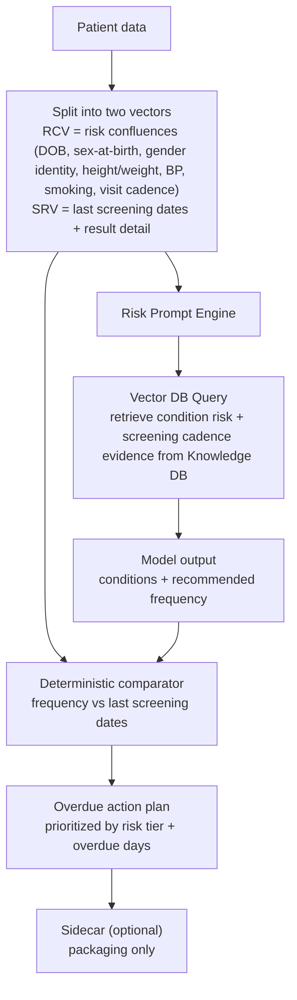

# Core Function Spec: Risk-Confluence + Screening-Recency Comparator

Generated: 2026-03-22

## Mission-Critical Function
Given a patient snapshot, determine:
1. which preventable/treatable conditions are most likely to escalate to emergency care if unaddressed
2. how often those conditions should be screened/monitored
3. whether the patient is overdue right now based on their actual last screening dates

The core is intentionally simple:
- Knowledge database informs condition risk + screening cadence.
- Patient data is split into exactly two vectors.
- One risk prompt output is compared deterministically against screening recency.

## Input A: Knowledge Database Requirements
The runtime knowledge layer must cover:
- condition-to-emergency-escalation risk evidence
- screening and monitoring eligibility criteria
- recommended screening frequencies/intervals
- referral/escalation thresholds for abnormal findings
- jurisdiction-specific guidance priority (BC first, then Canada)

## Input B: Patient Data Split Into Two Vectors
### Vector 1: Risk Confluence Vector (`RCV`)
All patient factors that influence preventable escalation risk.

Minimum RCV fields:
- demographics and identity context (`date_of_birth`, computed age, `sex_at_birth`, `gender_identity` when available)
- anthropometrics (height, weight, derived BMI when available)
- active conditions/problem list
- medications/allergies
- relevant recent vitals/labs, including explicit blood pressure (`systolic_bp`, `diastolic_bp`, measurement date)
- utilization and care engagement history (ED/hospital/no-shows, `last_primary_care_visit_date`, `next_scheduled_visit_date`)
- risk modifiers (polypharmacy, adherence signals, smoking/tobacco/vaping status, quit date when applicable, key comorbidities)
- `pregnancy_status` when clinically applicable

### Vector 2: Screening Recency Vector (`SRV`)
A condition-keyed record of last screening/preventive checks.

Minimum SRV fields:
- `condition_or_screening_type`
- `last_completed_date`
- `source` (EHR, claims, patient-reported)
- optional `result_status` (normal/abnormal/unknown)
- optional `result_value` (structured or coded)
- optional `abnormality_severity` (`mild|moderate|severe|unknown`)

## Availability-First Context Builder (Normative)
Build vectors using most-available data first.

Data waterfall:
1. Tier 1 (almost always present): DOB/age, sex-at-birth, problem list, meds/allergies, scheduling/no-show history, last/next primary care visit dates
2. Tier 2 (usually present): gender identity, recent labs/vitals (including updated weight and blood pressure), smoking/tobacco/vaping status, preventive dates, referral/order status
3. Tier 3 (variable): ED/hospital feed, pharmacy refill history, external reports
4. Tier 4 (optional): pregnancy status, SDOH, device streams, external context

Deterministic rules:
1. Populate `RCV` and `SRV` from highest available tier.
2. Missing values are `unknown`, never treated as "no risk" or "up to date."
3. Emit confidence and missing-data tasks with vector outputs.
4. Source precedence: `EHR > scheduling > pharmacy/claims > patient-reported > external`.
5. Vector precision scales with availability:
   - if key fields are present, use full specificity in risk prompting and comparator logic
   - if key fields are missing, keep deterministic output but lower confidence and emit explicit completion tasks

## Risk Prompt Construction (From RCV Only)
Generate one concise but comprehensive prompt from RCV:

```text
Patient summary:
- DOB 1981-02-10, 45-year-old, sex at birth male, gender identity man
- height 180 cm, weight 129 kg (285 lb)
- BP 152/94 mmHg (2026-03-14), smoking status current
- hypertension, no known structural heart disease
- medications: X, Y, Z
- last PCP visit: 2026-03-14; next scheduled visit: 2026-04-22
- recent visit: routine check-up, no targeted screening completed
- key findings/risk modifiers: [...]

Question:
Based on these factors, which preventable/treatable conditions are most likely to lead to emergency treatment if unaddressed, and what screening/monitoring frequency is recommended for each?
```

Required model output schema (machine-readable):
```json
{
  "targets": [
    {
      "condition": "string",
      "risk_tier": "high|medium|low",
      "screening_type": "string",
      "interval_days": 0,
      "why": "string",
      "evidence_refs": ["doc_id_or_url"]
    }
  ]
}
```

## Deterministic Overdue Comparator (RCV Output vs SRV)
For each `target`:
1. Find matching `last_completed_date` in SRV.
2. Compute:
   - `due_date = last_completed_date + interval_days`
   - `overdue_days = today - due_date`
3. Assign deterministic status:
   - `overdue_now` if overdue_days > 0
   - `due_soon` if due_date within 30 days
   - `up_to_date` otherwise
   - `unknown_due` if no trusted last date exists
4. Priority order:
   - risk tier (`high > medium > low`)
   - then overdue severity (`overdue_days` descending)
   - then confidence (higher first)

No probabilistic ranker is required in core comparison.

## Condition-to-Screening Mapping Artifact (Required)
Deterministic comparison depends on a maintained mapping table:
- `configs/condition_screening_mapping.csv`

Minimum governance:
1. every active mapping row must include `source_doc_id`, `effective_date`, and `last_reviewed`
2. rows must be clinician-reviewed before status changes from `draft` to `active`
3. mapping updates must be versioned and referenced in release notes

## Core Output (Single Action Plan Object)
```json
{
  "run_id": "string",
  "patient_id": "string",
  "generated_at": "ISO-8601",
  "targets": [
    {
      "target_id": "string",
      "condition": "string",
      "screening_type": "string",
      "risk_tier": "high|medium|low",
      "interval_days": 0,
      "last_completed_date": "YYYY-MM-DD|null",
      "due_date": "YYYY-MM-DD|null",
      "status": "overdue_now|due_soon|up_to_date|unknown_due",
      "overdue_days": 0,
      "priority_rank": 0,
      "confidence": "high|medium|low",
      "rationale": "string",
      "evidence_refs": ["string"]
    }
  ],
  "missing_data_tasks": ["string"],
  "requires_clinician_review": true
}
```

## Output Persistence and Queueing (Required)
All run outputs must be persisted so the system can aggregate every run and compute the highest-value action queue.

Storage rules:
1. Write one row per `target` into an append-only fact table (do not overwrite historical runs).
2. Keep immutable history by `run_id` and `generated_at`.
3. Build a latest-state view for each `patient_id + condition + screening_type`.
4. Build a patient-level highest-value action view from the latest-state rows.

Recommended fact table fields:
- `run_id`, `generated_at`
- `patient_id`, `target_id`
- `condition`, `screening_type`
- `risk_tier`, `status`, `overdue_days`, `due_date`
- `interval_days`, `priority_rank`, `confidence`
- `missing_data_tasks_count`
- `evidence_refs_json`

Recommended latest-state view logic:
- partition by `patient_id, condition, screening_type`
- keep the newest row by `generated_at DESC, run_id DESC`

Recommended highest-value action scoring (deterministic):
- base by risk tier: `high=300`, `medium=200`, `low=100`
- add status points: `overdue_now=80`, `due_soon=40`, `unknown_due=20`
- add overdue contribution: `min(max(overdue_days, 0), 180)`
- add confidence points: `high=20`, `medium=10`, `low=0`

Queue ordering:
1. For each patient, keep the single highest-scoring action from latest-state rows.
2. Sort clinic-wide queue by `action_value_score DESC`, then `overdue_days DESC`.
3. Use this queue as the default "who to act on first" operational list.

## Sidecar Pass (PS / Egg Wash)
Runs only after core output is finalized.

Allowed:
- clinician/patient wording polish
- owner/channel assignment
- operational notes

Forbidden:
- changing condition selection
- changing interval/frequency
- changing overdue status or priority rank

## Explicitly Out of Core
- multi-vector experimentation beyond `RCV` and `SRV`
- multi-stage ranking stacks for core overdue decision
- capacity allocator modifying clinical overdue truth
- broad optional enrichment feeds as required dependencies

## Simplified End-to-End Flow

