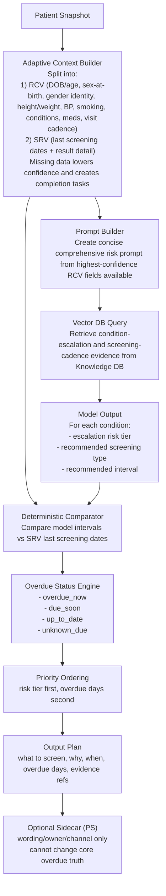

# Current Theoretical Operation Flowsheet

```mermaid
flowchart TD
  B["Patient Snapshot"] --> C["Adaptive Context Builder<br/>Split into:<br/>1) RCV (DOB/age, sex-at-birth, gender identity, height/weight, BP, smoking, conditions, meds, visit cadence)<br/>2) SRV (last screening dates + result detail)<br/>Missing data lowers confidence and creates completion tasks"]
  C --> D["Prompt Builder<br/>Create concise comprehensive risk prompt from highest-confidence RCV fields available"]
  D --> A["Vector DB Query<br/>Retrieve condition-escalation and screening-cadence evidence from Knowledge DB"]
  A --> E["Model Output<br/>For each condition:<br/>- escalation risk tier<br/>- recommended screening type<br/>- recommended interval"]
  C --> F["Deterministic Comparator<br/>Compare model intervals vs SRV last screening dates"]
  E --> F
  F --> G["Overdue Status Engine<br/>- overdue_now<br/>- due_soon<br/>- up_to_date<br/>- unknown_due"]
  G --> H["Priority Ordering<br/>risk tier first, overdue days second"]
  H --> I["Output Plan<br/>what to screen, why, when, overdue days, evidence refs"]
  I --> J["Optional Sidecar (PS)<br/>wording/owner/channel only<br/>cannot change core overdue truth"]
```
